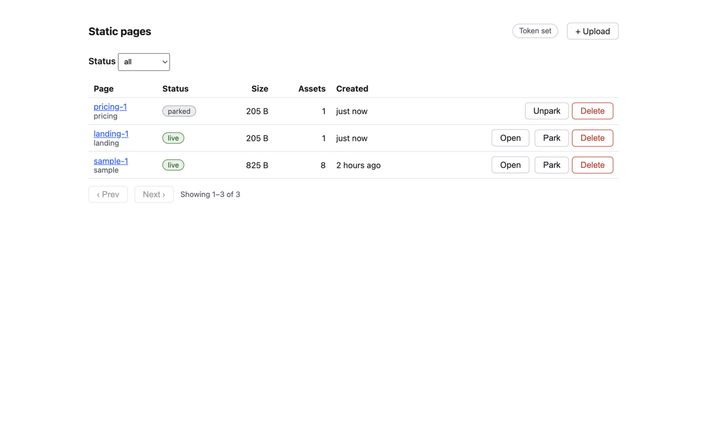

# Page

Page is self-serve hosting for static pages. Drop in an HTML file or a zip
exported from Figma or Framer — or saved straight from your browser — and
get a permanent URL on your own domain, in seconds, without engineering or
ops help.

## Quick start

Prerequisites:

- **Go** — runs the server.
- **Docker** — runs MinIO (S3-compatible object storage, API on :9000,
  console on :9001), started by `make up`. The storage bucket is created
  automatically; the write-side database is a local SQLite file
  (`./data/page.db`), no container needed.

```bash
make up      # MinIO via docker compose
make run     # server on :8080 (auth token: devtoken)
make seed    # uploads a sample Framer-style pack (no server needed)
open http://localhost:8080/p/sample-1/
```

## Manage pages

Open `http://localhost:8080/`, enter token `devtoken`, and you get the
management UI: every page with its lifecycle status, the full asset manifest
per page, park/unpark, and permanent delete. Upload lives there too —
optionally set an identifier and drop an `.html` file or a `.zip`:



Or use the API:

```bash
# Upload (→ 201 {"slug":"landing-page-1","url":"/p/landing-page-1/",...})
curl -H "Authorization: Bearer devtoken" -F "file=@pack.zip" \
     -F "identifier=landing-page" http://localhost:8080/api/pages

# List pages (paginated: ?limit=&offset=&status=)
curl -H "Authorization: Bearer devtoken" http://localhost:8080/api/pages

# Page detail with the full asset manifest
curl -H "Authorization: Bearer devtoken" http://localhost:8080/api/pages/landing-page-1

# Take down (serves 404) / restore
curl -H "Authorization: Bearer devtoken" -X POST http://localhost:8080/api/pages/landing-page-1/park
curl -H "Authorization: Bearer devtoken" -X POST http://localhost:8080/api/pages/landing-page-1/unpark

# Delete permanently (objects + metadata; refuse while a transition runs)
curl -H "Authorization: Bearer devtoken" -X DELETE http://localhost:8080/api/pages/landing-page-1
```

The page is served at `/p/{slug}/`. Deleting a page frees its slug's storage
but never reuses its code — slug counters only move forward.

## Basic configuration

| Variable | Default | Notes |
|---|---|---|
| `SERVER_MODE` | `all` | `serve` pages/assets only · `admin` upload UI + API only · `all` everything |
| `SQLITE_PATH` | — | path of the SQLite database file; required in `admin`/`all` modes, not needed in serve mode (`make run` uses `data/page.db`) |
| `AUTH_MODE` | `token` | admin-plane auth: `token` static bearer · `none` proxy/network-protected · `oidc` SSO login (see below) |
| `AUTH_TOKEN` | `devtoken` | bearer token for `/api/*`; required in `token` mode, forbidden in `none`, optional in `oidc` (machine path) |
| `OIDC_ISSUER` / `OIDC_CLIENT_ID` / `OIDC_CLIENT_SECRET` / `OIDC_REDIRECT_URL` | — | required when `AUTH_MODE=oidc`; redirect URL is `{base}/auth/callback` |
| `SESSION_SECRET` | — | required when `AUTH_MODE=oidc`; generate with `openssl rand -hex 32`. Rotating it logs everyone out |
| `STORAGE_DRIVER` | `s3compat` | or `mem` (tests) |
| `S3_ENDPOINT` | `localhost:9000` | required for s3compat |
| `S3_ACCESS_KEY` / `S3_SECRET_KEY` | `minioadmin` | required for s3compat |
| `S3_BUCKET` | `pages` | |
| `S3_SECURE` | `false` | https to the endpoint |
| `S3_PATH_STYLE` | `true` | MinIO needs `true` |
| `ADDR` | `:8080` | |
| `HTML_CACHE_TTL` | `60s` | how fast parked pages stop serving |

Storage works with any S3-compatible endpoint (AWS S3, R2, B2, Spaces,
MinIO, …), configured entirely via env.

### Database and recovery (Litestream)

The write side keeps pages, the asset manifest, and slug counters in one
SQLite file (`SQLITE_PATH`) — the serve path never reads it. In production a
[Litestream](https://litestream.io) sidecar continuously replicates the
database's WAL into the same S3 bucket under the reserved `_db/` prefix
(replica objects are unreachable from the public edge, which only maps
`/p/*` and `/a/*` into the bucket):

```yaml
# litestream.yml — runs beside the admin/all instance
dbs:
  - path: /data/page.db
    replicas:
      - url: s3://pages/_db
        endpoint: http://s3.internal:9000   # or your provider's endpoint
        access-key-id: ...
        secret-access-key: ...
```

Deployment rules:

- **One admin writer.** SQLite is a local file: exactly one admin/all
  instance may write it. Two processes booting against the same file are
  safe (migrations serialize on SQLite's write lock), but two hosts must
  never write one database — orchestration must prevent it.
- **Boot order:** `litestream restore -if-db-not-exists -o /data/page.db
  s3://pages/_db` before the server starts, then the server (migrations run
  on boot), then `litestream replicate`. On a fresh host the restore
  recovers the bookkeeping; without it the database starts empty.
- **Recovery window:** replication is asynchronous (~1s). After a crash and
  restore, the bucket can be a hair ahead of the database — an uploaded page
  may serve without a manifest row, or a parked page's status may read
  `live` while its objects sit under `_parked/`. Re-running the operation
  converges both (uploads re-write their rows; toggles re-run their move).
  If the admin UI and the bucket ever disagree, re-run the toggle.

Moving an existing Postgres deployment: run `go run ./cmd/pgmigrate -pg
$DATABASE_URL -sqlite /data/page.db` once against a fresh target (it refuses
a non-empty one).

### Admin auth modes

`AUTH_MODE` picks how the admin plane (`/` and `/api/*`) authenticates.
Pages (`/p/*`, `/a/*`) and `/healthz` are always public.

- **`token`** (default): every API call needs the static bearer. Works
  anywhere; the UI asks for the token and stores it in `localStorage`.
- **`none`**: no in-app auth — the deployment is protected by network
  position and/or an authenticating reverse proxy (oauth2-proxy, nginx,
  Tailscale, …). Boot logs a warning; `AUTH_TOKEN` must be unset. The admin
  instance must never be directly reachable by untrusted clients.
- **`oidc`**: the app is an OIDC relying party. Register a client with your
  IdP (redirect `{base}/auth/callback`, scope `openid email`), set the four
  `OIDC_*` variables plus `SESSION_SECRET`, and browsers log in through the
  IdP; unauthenticated visits to `/` redirect to `/login`. If `AUTH_TOKEN`
  is also set it keeps working as the machine path for CI/scripts. Sessions
  are stateless signed cookies (12h); rotating `SESSION_SECRET` revokes
  them all.

The full variable list and validation rules are in `internal/config`; the
production deployment guide is in [AGENTS.md](AGENTS.md).
